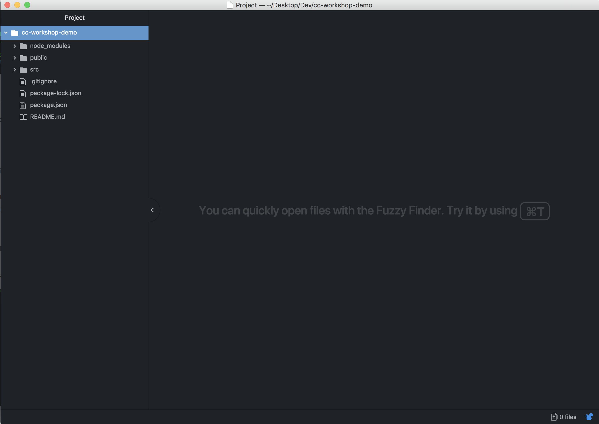

## Part A. P5 Creative Coding

#### 1. Install Node-JS

[Download](https://nodejs.org/en/) (choose the recommended one on the left)

#### 2. Go to Application -> Other -> Terminal, type

```shell
npx create-react-app cc-workshop-demo
```

#### 3. When finished, type

```shell
cd cc-workshop-demo;npm start
```
#### 4. Your browser will automatically open, you should be able to see this following screen:


#### 5. Switch back to terminal, press command + T to open a new tab, and type

```shell
npm i react-p5-wrapper —save
```
#### 6. When finished, type

```shell
vi package.json
```

and you should be able to see the following line

```shell
"react-p5-wrapper": "0.0.4",
```
#### 7. When confirmed, type the following command to quit vim

```shell
:wq
```

#### 8. Install Atom - Text editor

[Download](https://atom.io/)

#### 9. When finished, switch back to terminal, click command + T to open a new tab, and then type

```shell
cd ..;open .
```
#### 10. Open the cc-workshop-demo folder with Atom, and you should be able to see this



#### 11.  Click the file src/App.js, and replace the entire file with the following code

```javascript
import React, { Component } from 'react';
import './App.css';
//dependencies
import P5Wrapper from 'react-p5-wrapper';

class App extends Component {

  render() {
    return (
      <div className="App">
      </div>
    );
  }

}

export default App;

```

#### 12. Right click on the src folder icon and create a new file, name it “sketch.js”, and then copy the following code

```javascript
export default function sketch (p) {

  p.preload = function () {

  }

  p.setup = function () {
    p.createCanvas(600, 400, p.WEBGL);
  };

  p.myCustomRedrawAccordingToNewPropsHandler = function (props) {

  };

  p.draw = function () {
    p.background(255);
    p.rotateX(p.frameCount * 0.01);
    p.rotateY(p.frameCount * 0.01);
    p.box(50);
  };
};
```

#### 13. Click the file src/App.js, and add the following code below line 4

```javascript
import sketch from './sketch';
```
And the following code below line 11

```html
<P5Wrapper sketch={sketch}/>
```

#### 14. Switch to browser, you should be able to see a spinning box. Congrats, you are now all set!


## Part B. Hardwares & Arduino

Due to security concern, our employee laptops (Beijing Office) do not support serial I/O (our keyboards are the only source of input), which means if you want to get hands on Part B, please bring your own laptop to the workshop, I will guide you through the rest of the installation steps.

Sorry for the inconvenience.
